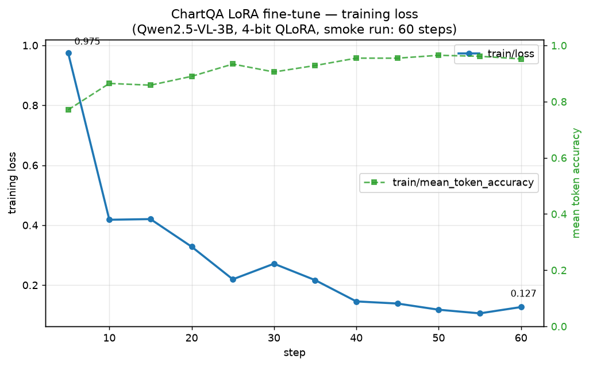

# Fine-Tuning a Vision-Language Model with LoRA and QLoRA: A Hands-On Guide

A vision-language model (VLM) takes images *and* text as input and produces
text. Modern open VLMs — Qwen2.5-VL, Llama 3.2 Vision, Gemma 3, InternVL — are
built by bolting a vision encoder onto a language model, so they inherit the
same problem as plain LLMs: full fine-tuning updates billions of weights and
needs more memory than most people have.

The fix is the same one that works for text. LoRA (Low-Rank Adaptation) freezes
the base model and trains only a small pair of low-rank matrices next to the
original weights. QLoRA loads the frozen base in 4-bit, so a 3B–7B VLM fits
comfortably on a single 16 GB GPU. If you have read the text-only guide in the
sibling `LoRA-FT` repo, the method here is identical — this guide focuses on the
four things that are genuinely different for vision:

1. You load an **image-text-to-text** model and use a **processor** (tokenizer +
   image processor), not just a tokenizer.
2. Your dataset carries **images** alongside the text.
3. You almost always **freeze the vision encoder** and adapt only the language
   model.
4. A handful of trainer settings are VLM-specific — most importantly, **packing
   must be off** and you should train with **completion-only loss** so the
   hundreds of image tokens don't pollute the loss.

This guide is code-first. The example fine-tunes `Qwen/Qwen2.5-VL-3B-Instruct`
to answer questions about charts (the ChartQA dataset), a task where the base
model is mediocre and a small adapter gives a visible lift.

> **Runnable code.** Every snippet below is assembled into three scripts —
> `train.py` (Sections 3–9), `inference.py` (Section 10), and `merge.py`
> (Section 11) — with a `README.md` and `requirements.txt`. Run the smoke test
> in the README first if you just want to watch the pipeline work end to end.

What you need: one GPU with ~16 GB of VRAM, Python 3.10+, and a Hugging Face
account only if you pick a gated model (Qwen2.5-VL is not gated).

---

## 1. The idea in one screen

LoRA is unchanged from the text case. A linear layer computes `h = W0 · x`; LoRA
freezes `W0` and adds a low-rank update beside it:

```
h = W0 · x + (alpha / r) · B · A · x
```

`A` is `(r, k)`, `B` is `(d, r)`, the rank `r` is small (8–64), and only `A` and
`B` train. `B` starts at zero so the model begins exactly at the base behaviour.

What is new for a VLM is **where** you put the adapters. A VLM has two stacks:

- a **vision encoder** (a ViT) that turns image patches into a sequence of
  visual tokens, plus a small projector that maps them into the language model's
  embedding space, and
- a **language model** that consumes the visual tokens interleaved with the text
  tokens and generates the answer.

The standard, well-tested recipe is to **freeze the vision encoder and adapt
only the language model's projections** (`q_proj`, `k_proj`, `v_proj`, `o_proj`
and the MLP `gate_proj`, `up_proj`, `down_proj`). The vision encoder already
produces good features; what you usually want to teach is how the language model
*reasons about* those features for your task. Adapting the vision tower as well
is possible (`--tune-vision` in the code) but costs more memory and rarely helps
for instruction-style tasks.

QLoRA adds one thing: the frozen language-model weights are stored in 4-bit
(NF4), while the LoRA matrices and the (small) vision encoder stay in 16-bit.

---

## 2. Environment

The vision stack moves fast. Qwen2.5-VL needs `transformers >= 4.49`, and native
VLM support in TRL's `SFTTrainer` (the on-the-fly image collator) needs a recent
`trl`. Install recent versions:

```bash
pip install -U "transformers>=4.49" "trl>=0.14" "peft>=0.13" \
               "datasets>=3.0" "accelerate>=1.0" "bitsandbytes>=0.44" \
               qwen-vl-utils torchvision pillow requests tensorboard
```

```python
import torch
from datasets import load_dataset
from transformers import (
    AutoModelForImageTextToText,
    AutoProcessor,
    BitsAndBytesConfig,
)
from peft import LoraConfig
from trl import SFTConfig, SFTTrainer

MODEL_ID = "Qwen/Qwen2.5-VL-3B-Instruct"
# Smaller alternative: "Qwen/Qwen2-VL-2B-Instruct"
```

`AutoModelForImageTextToText` is the modern, architecture-agnostic class for
image+text→text models; it replaces the older per-model classes like
`Qwen2_5_VLForConditionalGeneration` and works for Llama-Vision, Gemma 3, etc.

---

## 3. Load the base VLM in 4-bit

This is the "Q" in QLoRA. The key VLM-specific detail is in the last line:
**keep the vision encoder out of 4-bit**. The vision tower is small and
quantizing it measurably hurts quality, so we skip it (and `lm_head`).

```python
bnb_config = BitsAndBytesConfig(
    load_in_4bit=True,
    bnb_4bit_quant_type="nf4",
    bnb_4bit_use_double_quant=True,
    bnb_4bit_compute_dtype=torch.bfloat16,
    llm_int8_skip_modules=["visual", "lm_head"],  # keep vision tower in 16-bit
)

model = AutoModelForImageTextToText.from_pretrained(
    MODEL_ID,
    quantization_config=bnb_config,
    dtype=torch.bfloat16,
    device_map="auto",
    # attn_implementation="flash_attention_2",  # add if flash-attn is installed
)
model.config.use_cache = False   # required with gradient checkpointing
```

The skip-module name (`"visual"`) is Qwen's name for its vision tower. For other
models check `print(model)` — Llama-Vision calls it `vision_model`, Gemma 3
`vision_tower`. On Ampere or newer GPUs use `bfloat16`; on a T4 use
`torch.float16` everywhere instead.

> **Version note.** `dtype=` is the current argument name. If you get a
> `TypeError` about an unexpected keyword `dtype`, your Transformers is older —
> use `torch_dtype=torch.bfloat16` instead (it means the same thing). This
> applies everywhere `dtype=` appears below (Sections 10 and 11).

---

## 4. The processor

A VLM does not use a bare tokenizer. It uses a **processor** that bundles the
tokenizer with an image processor. The processor also owns the chat template,
which for a VLM knows how to splice image placeholder tokens into the prompt.

```python
processor = AutoProcessor.from_pretrained(
    MODEL_ID,
    # Bound how many visual tokens each image becomes. Each 28x28 patch is one
    # token, so a large image can explode into thousands of tokens and blow up
    # memory. These caps keep it sane.
    min_pixels=4 * 28 * 28,
    max_pixels=512 * 28 * 28,
)
```

`min_pixels`/`max_pixels` are the single most important memory knob for VLM
training. A 1280×960 photo at full resolution is ~1500 visual tokens *per
image*; capping `max_pixels` brings that down dramatically with little accuracy
loss for most tasks. (These two arguments are Qwen-VL's interface; other
processors expose `size={"longest_edge": ...}` or similar.)

---

## 5. Prepare the dataset

This is where vision differs most from text. Each example needs the **image(s)**
plus the conversation. We use ChartQA, which has an `image`, a `query`, and a
`label`.

The format that matters: produce each example as `{"images", "prompt",
"completion"}`. TRL recognises this *prompt-completion* format and computes the
loss **only on the completion** (the answer) — masking the prompt, which is where
all the image-placeholder tokens live.

```python
raw = load_dataset("HuggingFaceM4/ChartQA", split="train")

def to_chat(example):
    answer = example["label"]
    if isinstance(answer, list):
        answer = answer[0]
    return {
        "images": [example["image"]],                                # list of PIL images
        "prompt": [{"role": "user", "content": example["query"]}],   # plain text is fine
        "completion": [{"role": "assistant", "content": str(answer)}],
    }

dataset = raw.map(to_chat, remove_columns=raw.column_names)

# Inspect one example before training.
print(dataset[0]["prompt"])
print(dataset[0]["completion"])
print(dataset[0]["images"][0].size)
```

Two things to note:

- The message `content` is a plain string. You do **not** hand-insert an
  `{"type": "image"}` block — TRL's vision collator calls
  `prepare_multimodal_messages` for you and injects the image placeholder before
  the first user turn, then matches it to the image in `"images"`.
- **Why prompt-completion and not a single `messages` list?** With a flat
  `messages` field, TRL falls back to language-modeling loss over *every* token,
  including the hundreds of image-placeholder tokens. In practice that sends the
  training loss to absurd values (we measured ~16 with ~6% token accuracy) because
  the model is being asked to "predict" image tokens. Switching to
  prompt-completion (which masks the prompt) drops the loss to a healthy ~0.2–0.7.
  This is the most common silent mistake in VLM SFT.

**Sanity check.** The `print(...)` output above next to the chart it describes —
`dataset[0]` from ChartQA, with its prompt/completion and image size:

![ChartQA dataset[0]: the rendered chart beside the prompt/completion print output](assets/sanity_check.png)

---

## 6. The LoRA configuration

Adapt the language model's attention and MLP projections, and **exclude the
vision tower** so it stays frozen.

```python
lora_config = LoraConfig(
    r=16,
    lora_alpha=32,                # alpha = 2*r is a safe default
    lora_dropout=0.05,
    bias="none",
    task_type="CAUSAL_LM",
    target_modules=[
        "q_proj", "k_proj", "v_proj", "o_proj",   # attention
        "gate_proj", "up_proj", "down_proj",      # MLP
    ],
    exclude_modules=r".*visual.*",   # freeze the vision encoder (Qwen names it "visual")
)
```

Why `exclude_modules`? Qwen2.5-VL's vision blocks *also* contain layers named
`gate_proj`/`up_proj`/`down_proj`, so a bare `target_modules` list would attach
adapters inside the vision tower too. The exclude regex keeps it frozen, which is
the standard recipe. (Drop the exclude — or pass `--tune-vision` in the code — if
you specifically want to adapt vision as well.)

You do **not** need to call `prepare_model_for_kbit_training` or `get_peft_model`
yourself; passing `peft_config` to `SFTTrainer` does it for you.

A useful check after the trainer is built: `trainer.model.print_trainable_parameters()`
should report well under 1% (we see `trainable params: 29,933,568 || all params:
3,784,556,544 || trainable%: 0.79`). If it is much higher, your `exclude_modules`
didn't take and you're training the vision tower by accident.

---

## 7. Training configuration and trainer

`SFTConfig` is the same class as the text case. Three settings are VLM-specific
and flagged below.

```python
sft_config = SFTConfig(
    output_dir="qwen2.5-vl-3b-chartqa-lora",
    num_train_epochs=1,
    per_device_train_batch_size=2,      # images are memory-heavy; start small
    gradient_accumulation_steps=8,      # effective batch size = 16
    gradient_checkpointing=True,
    gradient_checkpointing_kwargs={"use_reentrant": False},
    learning_rate=2e-4,
    lr_scheduler_type="cosine",
    warmup_ratio=0.03,
    logging_steps=5,
    save_strategy="epoch",
    bf16=True,                          # fp16=True on older GPUs
    max_length=2048,                    # prompt + completion token budget
    packing=False,                      # REQUIRED for VLMs (TRL raises otherwise)
    report_to="tensorboard",
)

trainer = SFTTrainer(
    model=model,
    args=sft_config,
    train_dataset=dataset,
    peft_config=lora_config,
    processing_class=processor,         # passing a *processor* turns on VLM mode
)

trainer.model.print_trainable_parameters()
```

The two things to internalise:

- **`processing_class=processor`.** Because you pass a processor (not a
  tokenizer), TRL switches into vision mode: it auto-selects
  `DataCollatorForVisionLanguageModeling`, which tokenizes text and converts
  images to pixel values **on the fly** for each batch (pre-processing every
  image to disk would be enormous).
- **`packing=False`.** Packing concatenates samples to fill the context window;
  that is incompatible with per-sample images, so TRL raises a `ValueError` if
  you leave it on. (For the same reason, `padding_free` and `assistant_only_loss`
  are not supported for VLMs in current TRL.)

---

## 8. Train

```python
trainer.train()
```

**Start small.** The full ChartQA train split is ~28k examples — about 1,750
optimizer steps at the batch size above, which is roughly 4+ hours on one GPU.
For your first pass, slice the dataset and cap the steps so you can confirm the
whole pipeline (and your loss curve) in a few minutes before committing to a long
run:

```python
raw = load_dataset("HuggingFaceM4/ChartQA", split="train[:512]")  # in Section 5
# ...and add to SFTConfig:
#   max_steps=40,
```

The accompanying `train.py` exposes these as `--subset-size` and `--max-steps`
(see the README smoke test), so you don't have to edit the code.

Watch the **training loss** (should fall into the 0.2–0.7 range for ChartQA and
flatten) and **GPU memory** via `nvidia-smi`. If you hit out-of-memory, the
cheapest fixes in order are: lower `max_pixels` (this is usually the biggest
lever for VLMs), then `per_device_train_batch_size`, then raise
`gradient_accumulation_steps` to keep the effective batch size constant.

**Loss curve.** Launch `tensorboard --logdir qwen2.5-vl-3b-chartqa-lora` to watch
it live. Below is the curve from a smoke run (60 steps on a 512-example subset,
4-bit QLoRA): training loss falls from ~1.0 to ~0.13 and token accuracy climbs to
~0.95 — squarely in the healthy 0.2–0.7 band and flattening.



---

## 9. Save the adapter

```python
trainer.save_model("qwen2.5-vl-3b-chartqa-lora/final")
processor.save_pretrained("qwen2.5-vl-3b-chartqa-lora/final")
```

Save the **processor** next to the adapter, not just the tokenizer — you need the
image-processing config (including your `min/max_pixels`) at inference time. The
adapter itself is small (tens of MB); the processor adds the tokenizer files.

---

## 10. Inference

Load the base VLM and attach the adapter, then ask a question about an image.

```python
from io import BytesIO
import requests
from PIL import Image
from peft import PeftModel

base = AutoModelForImageTextToText.from_pretrained(
    MODEL_ID, quantization_config=bnb_config, dtype=torch.bfloat16, device_map="auto",
)
model = PeftModel.from_pretrained(base, "qwen2.5-vl-3b-chartqa-lora/final")
model.eval()

processor = AutoProcessor.from_pretrained("qwen2.5-vl-3b-chartqa-lora/final")

image = Image.open("chart.png").convert("RGB")   # or load from a URL
messages = [{
    "role": "user",
    "content": [
        {"type": "image"},
        {"type": "text", "text": "How many food items are shown in the bar graph?"},
    ],
}]
text = processor.apply_chat_template(messages, tokenize=False, add_generation_prompt=True)
inputs = processor(text=[text], images=[image], return_tensors="pt").to(model.device)

out = model.generate(**inputs, max_new_tokens=128, do_sample=False)
generated = out[0][inputs["input_ids"].shape[1]:]
print(processor.decode(generated, skip_special_tokens=True))
```

Two inference details specific to VLMs:

- At inference you build the content list explicitly with an `{"type": "image"}`
  block (unlike training, where TRL inserted it for you). The `apply_chat_template`
  call turns it into the right placeholder tokens; the `processor(...)` call then
  produces `pixel_values` and `image_grid_thw` next to `input_ids`. Always slice
  the output with `inputs["input_ids"].shape[1]` to drop the prompt.
- Prefer greedy decoding (`do_sample=False`) for short factual answers like chart
  readings; turn sampling on only for open-ended description.

If a freshly trained adapter outputs a stream of identical tokens (e.g. `!!!!`),
it is almost always **undertrained or overfit on a tiny set** — train for more
steps on more data — not a bug in the inference code. Verify by running the same
code with the base model and no adapter; it should answer normally.

---

## 11. Merge for deployment

For production, fold the adapter into the weights and save a standalone model
that vLLM or TGI can serve directly.

```python
from peft import PeftModel

# Merge into the 16-bit base, NOT the 4-bit one.
base_fp16 = AutoModelForImageTextToText.from_pretrained(
    MODEL_ID, dtype=torch.bfloat16, device_map="auto",
)
merged = PeftModel.from_pretrained(base_fp16, "qwen2.5-vl-3b-chartqa-lora/final")
merged = merged.merge_and_unload()
merged.save_pretrained("qwen2.5-vl-3b-chartqa-merged")
AutoProcessor.from_pretrained("qwen2.5-vl-3b-chartqa-lora/final").save_pretrained(
    "qwen2.5-vl-3b-chartqa-merged"
)
```

As with text LoRA, merge into the **16-bit** base, never the 4-bit one, to avoid
re-quantization error. Remember to save the processor into the merged folder too,
or downstream serving won't know how to preprocess images.

---

## 12. Choosing hyperparameters

| Setting | Default | When to change |
|---|---|---|
| `r` | 16 | Raise to 32–64 for hard visual reasoning; lower to 8 for tiny datasets |
| `lora_alpha` | `2 * r` | Keep the ratio when you change `r` |
| `target_modules` | LM attention + MLP | Add the vision tower (`--tune-vision`) only if LM-only underfits |
| `max_pixels` | `512·28·28` | Lower first when OOM; raise for fine detail (small text, dense charts) |
| `learning_rate` | 2e-4 | 1e-4 to 3e-4 typical; lower if loss is unstable |
| `per_device_train_batch_size` | 2 | Images dominate memory; tune together with `max_pixels` |
| `num_train_epochs` | 1–3 | VLMs overfit fast on small image sets; watch eval outputs |

The biggest VLM-specific lever is `max_pixels`: it trades visual detail for
memory and speed more directly than any text knob.

---

## 13. Common pitfalls

- **Flat `messages` format → wrong loss.** Use the `{"prompt", "completion"}`
  format so the loss is computed only on the answer. The flat-`messages` path
  trains on image-placeholder tokens and inflates the loss massively (Section 5).
- **Leaving `packing=True`.** Not supported for VLMs; TRL raises. Set it to
  `False`.
- **Quantizing the vision tower.** Keep it in 16-bit via
  `llm_int8_skip_modules=["visual", ...]`; 4-bit vision features degrade quality.
- **Vision tower adapted by accident.** Some VLMs reuse layer names like
  `gate_proj` in the vision blocks, so a bare `target_modules` list adapts them.
  Use `exclude_modules` and confirm with `print_trainable_parameters()`.
- **Forgetting to save the processor.** Saving only the adapter loses the image
  config; inference then preprocesses images wrong.
- **Huge images → OOM.** Set `max_pixels`. This matters far more than for text.
- **Wrong `compute_dtype` for the GPU.** `bfloat16` needs Ampere or newer; on a
  T4 use `float16` everywhere.

---

## 14. Evaluating the result

Loss going down is necessary but not sufficient. For VQA-style tasks, hold out a
validation split (`eval_dataset` + `eval_strategy="steps"`) and, more
importantly, compute **task accuracy** on held-out images — exact-match or
relaxed-accuracy for ChartQA, for example, since that is the number that actually
matters. Always read a handful of generated answers on images the model did not
see in training; a low loss with copy-paste-looking answers usually means you
over-trained on a small set.

---

## References

[1] E. J. Hu et al., "LoRA: Low-Rank Adaptation of Large Language Models," 2021. https://arxiv.org/abs/2106.09685

[2] T. Dettmers et al., "QLoRA: Efficient Finetuning of Quantized LLMs," 2023. https://arxiv.org/abs/2305.14314

[3] Qwen Team, "Qwen2.5-VL," 2025. https://github.com/QwenLM/Qwen2.5-VL

[4] Hugging Face, "TRL — Supervised Fine-tuning Trainer (VLM support)." https://huggingface.co/docs/trl/sft_trainer

[5] Hugging Face, "PEFT documentation." https://huggingface.co/docs/peft

[6] A. Masry et al., "ChartQA: A Benchmark for Question Answering about Charts," 2022. https://arxiv.org/abs/2203.10244
